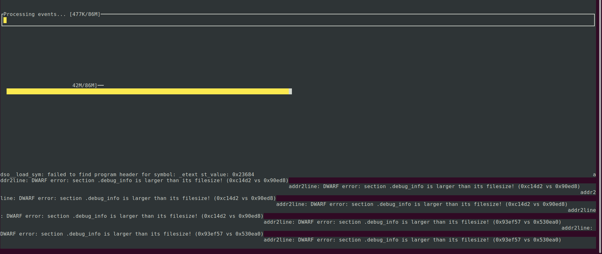

## Build jar

```shell
./gradlew assemble --no-daemon --rerun-tasks
```

A `jar` file will be generated in following folder `./perf-jmh/build/libs/perf-jmh-all.jar`

## Build native-image

```shell
export PROJECT_ROOT=<absolute_path>
```

```
 ~/w/G/perf-jmh  export PROJECT_ROOT=$(pwd)                                                 Mo 07 Nov 2022 20:14:17 CET
 ~/w/G/perf-jmh  echo $PROJECT_ROOT                                                         Mo 07 Nov 2022 20:15:56 CET
/home/user/Github/perf-jmh
```

```shell
native-image \
    -g -H:-DeleteLocalSymbols \
    --initialize-at-build-time=org.openjdk.jmh.infra,org.openjdk.jmh.util.Utils,org.openjdk.jmh.runner.InfraControl,org.openjdk.jmh.runner.InfraControlL0,org.openjdk.jmh.runner.InfraControlL1,org.openjdk.jmh.runner.InfraControlL2,org.openjdk.jmh.runner.InfraControlL3,org.openjdk.jmh.runner.InfraControlL4 \
    --gc=serial \
    --verbose \
    --no-fallback \
    -J-Xmx27g \
    -H:-SpawnIsolates \
    -H:IncludeResources="$PROJECT_ROOT/build/jmh-generated-resources/META-INF/BenchmarkList" \
    -H:Log=registerResource:verbose \
    -cp "$PROJECT_ROOT/build/libs/perf-jmh-all.jar" \
    -H:Name="io.sergejisbrecht.ce.java17.amd64" \
    io.sergejisbrecht.HelloWorld
```

```plain
...
[1/7] Initializing...                                                                                    (3.6s @ 0.27GB)
 Version info: 'GraalVM 22.3.0 Java 17 CE'
 Java version info: '17.0.5+8-jvmci-22.3-b08'
 C compiler: gcc (linux, x86_64, 9.4.0)
 Garbage collector: Serial GC
...
[thread:1] scope: main
  [thread:1] scope: main.registerResource
  ResourcesFeature: registerResource: META-INF/BenchmarkList
  [thread:1] scope: main.registerResource
  ResourcesFeature: registerResource: META-INF/CompilerHints
  [thread:1] scope: main.registerResource
  ResourcesFeature: registerResource: jmh.properties
  [thread:1] scope: main.registerResource
  ServiceLoaderFeature: registerResource: META-INF/services/sun.util.resources.LocaleData$CommonResourceBundleProvider
  [thread:1] scope: main.registerResource
  ServiceLoaderFeature: registerResource: META-INF/services/jdk.internal.logger.DefaultLoggerFinder
  [thread:1] scope: main.registerResource
  ServiceLoaderFeature: registerResource: META-INF/services/java.nio.file.spi.FileSystemProvider
  [thread:1] scope: main.registerResource
  ServiceLoaderFeature: registerResource: META-INF/services/sun.util.resources.LocaleData$SupplementaryResourceBundleProvider
  [thread:1] scope: main.registerResource
  Resources have been added by ServiceLoaderFeature. Automatic registration can be disabled with -H:-UseServiceLoaderFeature
  [thread:1] scope: main.registerResource
  ResourcesFeature: registerResource: java.base:java/lang/uniName.dat
[2/7] Performing analysis...  [******]                                                                  (13.1s @ 2.13GB)
   4,367 (80.50%) of  5,425 classes reachable
   6,170 (37.90%) of 16,278 fields reachable
  20,707 (49.95%) of 41,457 methods reachable
     239 classes,   683 fields, and 1,646 methods registered for reflection
      62 classes,    69 fields, and    53 methods registered for JNI access
       4 native libraries: dl, pthread, rt, z
[3/7] Building universe...                                                                               (1.7s @ 0.88GB)
[4/7] Parsing methods...      [*]                                                                        (1.4s @ 2.77GB)
[5/7] Inlining methods...     [***]                                                                      (1.1s @ 1.86GB)
[6/7] Compiling methods...    [***]                                                                     (10.9s @ 6.27GB)
[7/7] Creating image...                                                                                 (11.7s @ 4.25GB)
   7.17MB (18.36%) for code area:    13,042 compilation units
   9.69MB (24.80%) for image heap:  140,468 objects and 8 resources
  11.47MB (29.37%) for debug info generated in 7.9s
  10.74MB (27.48%) for other data
  39.07MB in total
------------------------------------------------------------------------------------------------------------------------
Top 10 packages in code area:                               Top 10 object types in image heap:
 827.45KB java.util                                            1.59MB byte[] for code metadata
 494.31KB java.lang.invoke                                     1.28MB java.lang.String
 430.78KB java.lang                                            1.08MB byte[] for general heap data
 385.55KB com.sun.crypto.provider                            983.78KB java.lang.Class
 347.86KB java.io                                            845.92KB byte[] for java.lang.String
 295.16KB java.util.concurrent                               467.02KB java.util.HashMap$Node
 254.34KB java.text                                          341.17KB com.oracle.svm.core.hub.DynamicHubCompanion
 205.32KB java.util.regex                                    275.73KB byte[] for reflection metadata
 196.22KB org.openjdk.jmh.runner                             270.00KB java.util.concurrent.ConcurrentHashMap$Node
 185.64KB java.math                                          243.22KB java.lang.String[]
   3.54MB for 173 more packages                                2.38MB for 1051 more object types
------------------------------------------------------------------------------------------------------------------------
                        1.1s (2.3% of total time) in 22 GCs | Peak RSS: 7.52GB | CPU load: 6.86
------------------------------------------------------------------------------------------------------------------------
```

## Perf

```shell
sudo sysctl kernel.perf_event_paranoid=1
sudo sysctl kernel.kptr_restrict=0
```

```shell
perf record -F 999 --call-graph dwarf -- ./io.sergejisbrecht.ce.java17.amd64 -XX:+PrintGC -XX:+PrintGCTimeStamps -XX:+ExitOnOutOfMemoryError -Xms10g -Xmx10g
```

```shell
perf report
```



## JDK

```
sudo sysctl kernel.perf_event_paranoid=1
sudo sysctl kernel.kptr_restrict=0
```

```
java -XX:TieredStopAtLevel=1 -Xmx1g -Xms1g -Xlog:gc -XX:+UseSerialGC -jar build/libs/perf-jmh-all.jar io.sergejisbrecht.VolatileAtomicBench  -prof async:libPath=/home/user/async-profiler-2.8.3-linux-x64/build/libasyncProfiler.so\;output=flamegraph\;title=test\;threads\;interval=10ms -f 1 -i 5 -wi 2
```